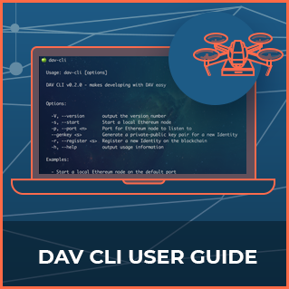
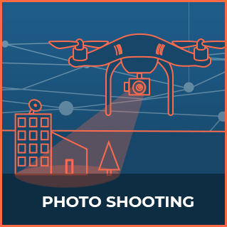
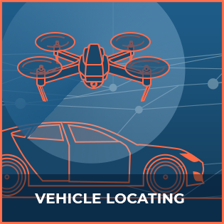
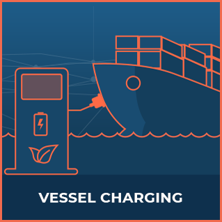

Welcome to the DAV Developer Portal. 

Here you will find instructions for running our command line interface, and our various communication protocols.

# DAV CLI

The DAV Command Line Interface was created to ease the development of applications and solutions that interact with DAV, and to enable to:
<ul>
	<li>Easily run a local Ethereum node containing DAV contracts</li>
	<li>Generate Identities secured by private public keys and register them on the blockchain</li>
	<li>Easily scaffold a new project, or modify an existing one to interact with DAV (under development)</li>
</ul>

<ul class="main-thumbs">
  <li></li>
</ul>

# Communication Protocols

The following protocols govern the communication between different vehicles, services, users, and applications using DAV.

<ul class="main-thumbs">
  <li></li>
  <li></li>
  <li></li>
  <li></li>
  <li></li>
  <li></li>
  <li></li>
  <li>
  <li>
</ul>

# Contribution

The communication protocols are based on the work of researchers and engineers in many countries. They are an open living standard by the community, for the community.

We invite you to join and contribute to them on <a href="https://github.com/DAVFoundation" target="blank">GitHub</a>.
